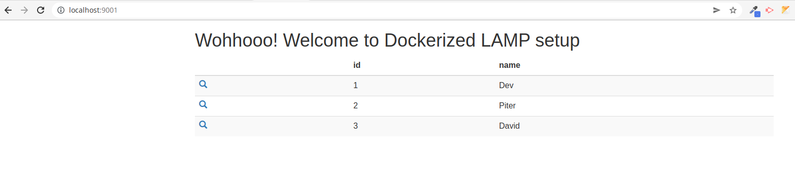

# LAMP

This project explains the setup instruction of LAMP with and without docker.

## LAMP using docker

**Apache**

**MySql 8.0**

**PhpMyAdmin**

**PHP 8 (Default)**

NOTE: for **php7.4** copy the below code replace with the existing [Dockerfile content](Dockerfile)

```
FROM php:7.4-apache 
RUN docker-php-ext-install mysqli pdo_mysql
RUN apt-get update \
    && apt-get install -y libzip-dev \
    && apt-get install -y zlib1g-dev \
    && rm -rf /var/lib/apt/lists/* \
    && docker-php-ext-install zip
```

For further PHP related docker modification see the [reference](https://github.com/Actency/docker-apache-php) .

### Docker setup

Prerequisite :

1. check for docker installation.

```
docker -v
```

Otherwise install [docker](https://www.digitalocean.com/community/tutorials/how-to-install-and-use-docker-on-ubuntu-18-04)

2. SSH key added in [NetTantra code station](https://code.nettantra.com/)
Otherwise do the [SSH Key Setup](https://code.nettantra.com/setupguide/ssh-key)

3. VSCODE [Docker extention](https://marketplace.visualstudio.com/items?itemName=ms-azuretools.vscode-docker)

---

1. Clone the repository

```
git clone git@code.nettantra.com:setupguide/lamp.git
```

2. Go to repository

```
cd lamp
```

3. Build dockerfile

```
docker-compose build
```

Wait for few minutes (It takes time!!)

4. Up the docker containers

```
docker-compose up -d
```

if you want to see the docker log then use below command

```
docker-compose up
```

5. Go to your browser and visit:

   _See [docker-compose.yml](docker-compose.yml) file for reference_

Simple php example: http://localhost:9001/

phpmyadmin: http://localhost:9002/

(username: root , password: root)


Run mysql client:


```
docker-compose exec db mysql -u root -p
```


